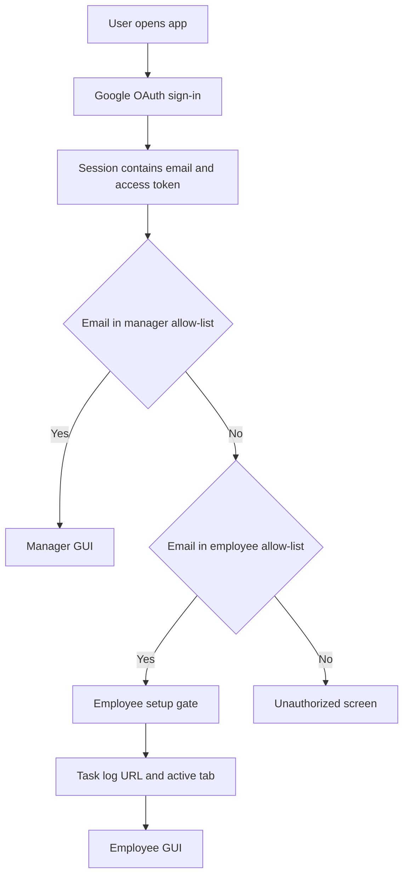

# GUI Access Requirements

This document defines what a new developer or team must configure for users to access the Lab Workflow Desktop GUI as either an employee or a manager. It is intentionally not tied to any specific person, spreadsheet, or deployment.

## Access Model

The app has three possible signed-in states:

- `manager`: the signed-in Google email appears in the configured manager allow-list.
- `employee`: the signed-in Google email appears in the configured employee allow-list.
- `unauthorized`: the signed-in Google email appears in neither allow-list.

Manager access takes precedence. If the same email is configured as both a manager and an employee, the app resolves that user as a manager.



## Developer-Owned Configuration

The app reads default configuration from Vite environment variables in `src/domain/app.ts` and allows managers to override those values locally in the in-app Setup panel. Local overrides are stored in browser/Tauri `localStorage`.

Required environment variables for a usable deployment:

```bash
VITE_GOOGLE_CLIENT_ID=<google-oauth-client-id>
VITE_ADMIN_SPREADSHEET_ID=<admin-spreadsheet-id-or-url>
VITE_MANAGER_EMAILS=<comma-or-newline-separated-manager-emails>
VITE_EMPLOYEE_EMAILS=<comma-or-newline-separated-employee-emails>
```

Hardcoded default admin sheet names:

- `SheetRegistry`
- `RunLog`
- `Feedback`
- `Roles`

These sheet names can be changed from the manager Setup panel, but a developer should keep the default names unless the admin spreadsheet is intentionally structured differently.

## Google Cloud Requirements

A developer must provision one Google Cloud project for the app.

Required setup:

- Enable the Google Sheets API.
- Create an OAuth client ID compatible with the current Google Identity Services browser flow.
- Add the app's development origin to the OAuth client. The current Vite dev server origin is `http://localhost:5173`.
- For packaged desktop builds, confirm the origin exposed by the Tauri WebView and configure the OAuth client accordingly. If the packaged origin cannot be authorized for Google Identity Services, the auth implementation must be changed to a desktop-appropriate OAuth flow before release.
- Ensure the OAuth consent screen includes the scopes used by the app:
  - `https://www.googleapis.com/auth/spreadsheets`
  - `https://www.googleapis.com/auth/userinfo.email`
  - `https://www.googleapis.com/auth/userinfo.profile`

The app currently requests broad read/write access to spreadsheets because it reads task logs and writes task updates directly through the Google Sheets API.

## Manager Access Requirements

To reach the manager GUI, all of the following must be true:

- The user signs in with Google successfully.
- The signed-in email is listed in `VITE_MANAGER_EMAILS` or in the locally overridden manager email list.
- `VITE_GOOGLE_CLIENT_ID` or the local Google OAuth client ID is set.
- `VITE_ADMIN_SPREADSHEET_ID` or the local admin spreadsheet ID/URL is set.
- The signed-in Google account has access to the admin spreadsheet.
- The signed-in Google account has access to every employee task-log spreadsheet referenced by active `SheetRegistry` rows.

The manager GUI loads the admin spreadsheet first. It then reads every active employee task log listed in `SheetRegistry`. If a manager can read the admin spreadsheet but not an employee's task log, the manager dataset load can fail or fall back to cached data.

### Required Admin Spreadsheet Structure

The admin spreadsheet must contain a `SheetRegistry` tab, or whatever tab name is configured as `sheetRegistryName`.

`SheetRegistry` must have a header row with columns that normalize to:

- `labmember`
- `tasklogurl`
- `activesheet`
- `active`

Header normalization lowercases the header and removes all non-alphanumeric characters. For example, `Lab Member`, `lab_member`, and `LAB MEMBER` all normalize to `labmember`.

Each active employee row must contain:

- Lab member display name.
- Employee task-log spreadsheet URL or spreadsheet ID.
- Active tab name inside that employee task-log spreadsheet.
- Active flag. Accepted active values are `true`, `yes`, `y`, or `1`, case-insensitive.

Optional `SheetRegistry` columns:

- `Profile Picture URL`, `Photo URL`, `Picture URL`, or `Profile URL`: an HTTPS URL to the employee's Google account profile picture or another approved avatar image. Manager task cards use this image when present and fall back to deterministic initials when it is blank or unavailable.

Optional admin tabs:

- `RunLog`: parsed if present. Expected columns normalize to `timestamp`, `labmember`, `tasklogurl`, `status`, and `note`.
- `Feedback`: parsed if present. Column A is the lab member; columns B onward are treated as timestamped feedback runs.
- `Roles`: parsed if present with columns that normalize to `email`, `role`, and `labmember`, but the current access-control implementation does not use this sheet to grant access. A developer must modify `src/auth/roles.ts` before `Roles` can become authoritative.

## Employee Access Requirements

To reach the employee GUI, all of the following must be true:

- The user signs in with Google successfully.
- The signed-in email is listed in `VITE_EMPLOYEE_EMAILS` or in the locally overridden employee email list.
- The signed-in email is not also listed as a manager, unless manager precedence is desired.
- `VITE_GOOGLE_CLIENT_ID` or the local Google OAuth client ID is set.
- The signed-in Google account has read/write access to their own task-log spreadsheet.
- The employee has supplied and validated:
  - Task log spreadsheet URL or ID.
  - Active sheet/tab name inside that spreadsheet.

Employee task-log preferences are stored locally per email. They are not currently supplied by `.env` and are not automatically pulled from the manager `SheetRegistry` for employee accounts.

Employees do not need access to the admin spreadsheet.

## Employee Task-Log Sheet Structure

Every employee task-log tab must have a header row in row 1. The app reads and writes within columns `A:Z`.

Expected task columns:

- `Project`
- `Experiment`
- `Time Estimate`
- `Start Date`
- `Projected End Date`
- `Status`
- `Schematic`
- `Result`
- `Link to Data`
- `Comments/ Improvements`
- `Notebook Location`

Accepted aliases in the current parser:

- `End Date` can be used instead of `Projected End Date`.
- `Analysis Pipeline Schema` can be used instead of `Schematic`.

Header matching uses normalized names, not exact display text. For example, `Projected End Date`, `projected_end_date`, and `PROJECTED-END-DATE` all normalize to `projectedenddate`.

The app treats all cell values as strings when reading from Google Sheets, then parses dates and statuses for compliance and timeline views:

- Dates should be actual Google Sheets date values or standard importable strings, preferably `YYYY-MM-DD` or `M/D/YYYY`.
- Non-standard or unparseable dates are invalid where dates are required for compliance, and they are invalid for timeline/Gantt rendering. Task cards should communicate this as an invalid date format rather than displaying the raw value as if it were usable.
- `Status` should use one of: `Planned`, `In Progress`, `Ongoing`, `Complete`, `Completed`, `Done`, `Blocked`, or another value containing `block` or `hold`.
- `Time Estimate` is free text. The UI suggests values like `4h`, but there is no strict validation.
- `Link to Data` is free text. The UI suggests a Dropbox URL, but the app does not currently validate URL format.

## Compliance Notes

Compliance is determined by `evaluateCompliance()` in `src/domain/compliance.ts`. The Google Sheets import path maps rows into task records; it does not decide compliance by itself.

A compliant employee task-log sheet has:

- A readable and writable active tab.
- A header row in row 1.
- Required task columns present by normalized header name: `Project`, `Experiment`, `Time Estimate`, `Start Date`, `Projected End Date`, `Status`, `Schematic`, `Result`, and `Link to Data`.
- `Projected End Date` may be supplied as `End Date`; `Schematic` may be supplied as `Analysis Pipeline Schema`.
- Required columns within `A:Z`, because that is the range the app currently reads and writes.

A compliant imported task from Google Sheets has:

- For non-completed work: `Project`, `Experiment`, `Time Estimate`, parseable `Start Date`, parseable `Projected End Date`, `Status`, `Schematic`, and `Link to Data`.
- For completed work: `Result` and `Link to Data`.
- Date values that parse as dates when dates are required. If a raw date value is present but unparseable, the card should indicate the date-format problem.

A compliant new task added from the GUI has:

- `Project`, `Experiment`, `Time Estimate`, `Start Date`, `Projected End Date`, `Schematic`, and `Link to Data` before creation.
- Dates supplied through date inputs and written in standard `YYYY-MM-DD` form.
- Optional `Comments / Improvements`, `Notebook Location`, and `Result` until the task is completed.
- Field-level guidance for required or non-compliant fields next to the affected inputs, so users can see what needs correction without checking a separate compliance summary.

## Gantt View Requirements

- Employees can render a Gantt chart for their own loaded task log.
- Managers can render a Gantt chart for all visible employees or any selected subset of visible employees.
- The Gantt view uses already-loaded task records; it does not make separate Google Sheets requests.
- The default date window is the current quarter. Users can choose any start date and end date to view an arbitrary range.
- PNG export uses the rendered chart in the browser. PDF export is handled through the system print dialog via `Print / Save as PDF`.
- Tasks with missing or invalid dates are excluded from positioned timeline bars and shown in the unscheduled/invalid-date repair queue.
- Unscheduled/invalid-date task cards include a `Fix task` action that opens the task edit flow so the user can correct dates or other required fields.

## Requirements for New Tasks

New tasks can be created by employees in their own workspace or by managers for any employee in `SheetRegistry`.

Required fields for new tasks:

- Project
- Experiment
- Time Estimate
- Start Date
- Projected End Date
- Schematic
- Link to Data

Optional fields:

- Comments / Improvements
- Notebook Location
- Result, until the task is completed

When the app creates a task, it reads the existing header row and writes values into matching columns. Unknown columns are written as blank for that new row.

## Requirements for Existing Tasks

Existing task rows can be displayed as long as at least one recognized task field has a value. Blank rows are ignored.

For reliable editing and completion:

- The row must still exist at the same row number after the app loaded it.
- The header row must still contain the expected columns.
- The user must retain write access to the spreadsheet.

Important implementation constraints:

- General task edits rewrite the full recognized row range based on the current header row.
- Marking a task complete updates only `Status`, `Result`, `Link to Data`, and `Schematic` when those columns exist.
- Resolving an overdue task requires `Projected End Date` or `End Date`, plus `Time Estimate`.
- Resolving overdue appends replacement values into the projected-end-date and time-estimate cells as multiline text with strikethrough formatting.

## Local Storage Requirements

The app stores these values locally on the device:

- App setup config: `lab-workflow/config`
- Google session: `lab-workflow/session`
- Employee task-log preferences per email: `lab-workflow/employee-prefs/<email>`
- Manager tab order per email: `lab-workflow/manager-tabs/<email>`
- Manager dataset cache per admin spreadsheet: `lab-workflow/dataset-cache/<spreadsheetId>`
- Manager change snapshot per email and admin spreadsheet.
- Manager last-run metadata per email.

A new device starts without these local overrides. Developers should treat `.env` / deployment defaults as the source for first-run configuration, and local setup as a convenience override.

## Onboarding Checklist

Use this checklist to bring a new deployment online.

1. Create or choose a Google Cloud project.
2. Enable the Google Sheets API.
3. Configure OAuth consent and create a Google OAuth client ID for the app.
4. Add `http://localhost:5173` for development and the packaged app origin for release.
5. Set `VITE_GOOGLE_CLIENT_ID`.
6. Create the admin spreadsheet.
7. Add a `SheetRegistry` tab with the required columns.
8. Add each employee's task-log URL, active tab name, display name, and active flag.
9. Share the admin spreadsheet with manager accounts.
10. Share each employee task-log spreadsheet with the appropriate employee and with manager accounts that need dashboard visibility.
11. Set `VITE_ADMIN_SPREADSHEET_ID`.
12. Set `VITE_MANAGER_EMAILS`.
13. Set `VITE_EMPLOYEE_EMAILS`.
14. Confirm each employee task-log active tab has the required header row.
15. Run the app and sign in as a manager.
16. Verify the manager dashboard loads all active employees from `SheetRegistry`.
17. Sign in as an employee.
18. Enter that employee's task-log URL and active tab name.
19. Verify the employee workspace loads and can create, edit, complete, and resolve overdue tasks.

## Known Gaps Developers Should Address

These are not setup requirements, but they affect operational reliability:

- The `Roles` sheet is parsed but not used for access control.
- Employee task-log preferences are local only; they are not centrally provisioned.
- Google Sheets values are read as formatted strings rather than canonical typed values.
- Header validation is implicit. Missing columns often degrade into blank fields rather than a clear schema error.
- General task edits can overwrite unrecognized columns in the edited row.
- Row identity is positional. If rows are inserted or deleted after load, updates can target the wrong row.
- Packaged Tauri OAuth behavior should be verified before production distribution.
