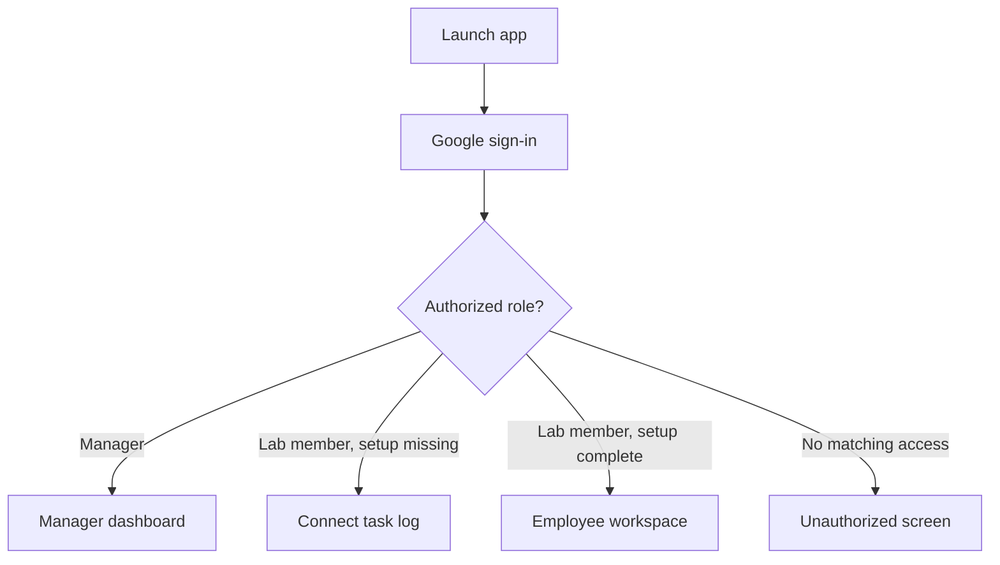
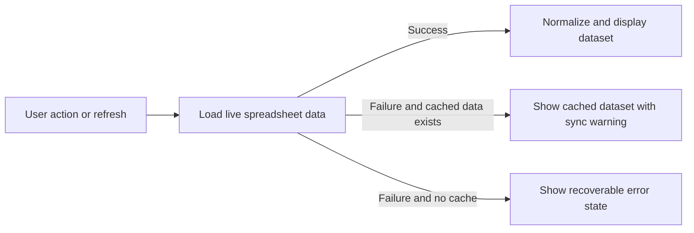

# Technical Product Requirements Document

## Product
Lab Workflow Desktop

## Document Status
Draft v1

## Audience
Product, engineering, design, and technical program stakeholders

## 1. Purpose
Lab Workflow Desktop is a role-based desktop application for managing experiment and task workflows in a research lab. It replaces direct day-to-day interaction with shared spreadsheets by providing a structured application experience for two primary personas:

- Lab members, who create, update, complete, and maintain their own experiment tasks
- Managers, who monitor progress across the lab, review compliance, assign work, and track changes over time

The product must preserve the current spreadsheet-centered operating model while improving usability, compliance, visibility, and operational consistency.

## 2. Product Goals
- Reduce friction for task creation and task updates
- Give managers a single operational view across all active lab members
- Enforce required-field and closeout rules before workflow data becomes stale or incomplete
- Preserve spreadsheet compatibility and existing operational data
- Support local desktop usage on macOS and Windows
- Provide resilient operation when live sync is temporarily unavailable

## 3. Non-Goals
- Replacing spreadsheets as the system of record
- Supporting a browser-only or mobile-first product experience in v1
- Introducing a custom backend service in v1
- Adding broad workflow automation beyond task management, compliance review, and status monitoring

## 4. Users and Roles

### 4.1 Lab Member
Primary user responsible for maintaining their own task log.

Needs:
- A simple way to connect their task log once and reuse it
- A clear view of planned, active, overdue, and completed work
- Guided workflows for creating, editing, completing, and updating overdue tasks
- Lightweight compliance feedback while working

### 4.2 Manager
Primary user responsible for reviewing team progress and compliance.

Needs:
- A lab-wide operational dashboard
- Fast filtering by employee
- Summary metrics for overall health
- Ability to add tasks directly for a lab member
- Visibility into recent changes and status trends

### 4.3 Unauthorized User
Signed-in user whose account is not allowed to access the application.

Needs:
- A clear explanation that access is restricted
- A way to sign out and retry with another account

## 5. Product Principles
- Role-first experience: the application should immediately route each user to the correct workspace
- Spreadsheet-compatible: the application must work with the current spreadsheet workflow rather than replace it
- Compliance-visible: missing fields, overdue work, and incomplete closeout must be surfaced clearly
- Local-first resilience: temporary sync issues should not make the application unusable
- Minimal setup burden: first-run setup must be short and understandable for both managers and lab members

## 6. High-Level Product Scope

### In Scope
- Google sign-in
- Role-based routing
- Manager setup workflow
- Lab member setup workflow
- Employee task board
- Manager dashboard
- Compliance validation and status classification
- Task creation and task updates
- Task completion workflow
- Overdue resolution workflow
- Task assignment by managers
- Sync with spreadsheet data source
- Local caching and local preference persistence
- Change tracking between manager refreshes

### Out of Scope
- Multi-tenant administration
- Fine-grained permissions beyond manager vs lab member
- Real-time collaborative editing with conflict resolution
- Push notifications
- Reporting exports beyond what is visible in-app

## 7. User Experience Overview

### 7.1 Entry Flow
1. User launches the desktop application.
2. User signs in with Google.
3. The application resolves the user role.
4. The application routes the user to:
   - the manager dashboard,
   - the lab member setup screen,
   - the lab member workspace, or
   - an unauthorized screen.

### 7.2 Role Routing Flow

### 7.3 Data Sync Flow

## 8. Functional Requirements

### 8.1 Authentication and Access Control

### Feature Summary
The application must authenticate users via Google and determine whether the user is a manager, lab member, or unauthorized.

### Requirements
- Users must sign in with a Google account before accessing any workspace.
- The application must determine role using configured allow-lists and, when available, spreadsheet-based role data.
- Managers must access only the manager workspace.
- Lab members must access only their own workspace.
- Unauthorized users must not see manager or lab member data.
- Users must be able to sign out from any authenticated screen.

### Acceptance Criteria
- A signed-out user cannot view tasks or dashboard data.
- A manager cannot land in the employee workspace.
- A lab member cannot land in the manager workspace.
- An unauthorized user sees a clear blocked-access state.

### 8.2 Manager Setup

### Feature Summary
Managers must be able to configure the application locally for admin spreadsheet access and role resolution.

### Requirements
- The application must provide a setup surface for:
  - admin spreadsheet URL or ID
  - Google client configuration
  - manager allow-list
  - employee allow-list
  - admin sheet names used by the app
- Configuration entered on one device must persist locally on that device.
- Managers must be able to reload data after changing setup values.
- Setup changes must not require a rebuild or redeploy.

### Acceptance Criteria
- A manager can open setup, modify configuration, and reload data in the same session.
- If setup is incomplete or incorrect, the app must show a recoverable error state rather than crash.

### 8.3 Lab Member First-Run Setup

### Feature Summary
Lab members must connect their personal task log before using the workspace.

### Requirements
- The application must prompt for:
  - task log spreadsheet URL
  - active sheet or tab name
- The application must validate the spreadsheet and tab before continuing.
- The validated task log connection must persist locally on the current device.
- Lab members must be able to change the connected task log later.

### Acceptance Criteria
- A valid task log and tab allow the user to enter the employee workspace.
- An invalid spreadsheet or tab name produces a specific validation error.
- A lab member can re-open setup and connect a different task log.

### 8.4 Employee Workspace

### Feature Summary
Lab members manage their personal experiment tasks from a four-lane board.

### Requirements
- The employee workspace must show the connected task log and active tab context.
- The board must display four lanes:
  - In Progress
  - Overdue
  - Planned
  - Completed
- Each task card must display, at minimum:
  - experiment name
  - project
  - status
  - start date
  - projected end date
  - time estimate
  - compliance indicator
- Each task card must support the actions relevant to its state:
  - edit
  - complete
  - resolve overdue
- The workspace must provide a prominent create-task action.
- The workspace must indicate loading and saving states clearly.
- The workspace must support switching between Kanban and Gantt views.
- The Gantt view must visualize the lab member's own task log for any selected date range.

### Acceptance Criteria
- Tasks are always classified into exactly one of the four lanes.
- Completed tasks do not expose the complete action again.
- Overdue tasks expose a dedicated overdue resolution action.
- Users can view and act on tasks without opening the underlying spreadsheet.
- Users can inspect their task timing in Gantt form without leaving the employee workspace.

### 8.5 Task Creation

### Feature Summary
Lab members and managers can create new tasks through a structured form.

### Required Fields
- Project
- Experiment
- Time estimate
- Start date
- Projected end date
- Status
- Schematic
- Link to data

### Optional Fields
- Notebook location
- Comments or improvements

### Requirements
- The create-task form must enforce required fields before save.
- The form must support task creation for the current lab member in the employee workspace.
- The form must support manager-created tasks assigned to a selected lab member.
- After creation, the board must refresh and display the new task in the correct lane.

### Acceptance Criteria
- Attempting to save without required fields must block submission and identify the missing fields.
- A successfully created task appears in the current dataset without requiring an app restart.

### 8.6 Task Editing

### Feature Summary
Users must be able to update an existing task's core details.

### Requirements
- Users must be able to edit all task metadata that is part of the standard task record.
- The edit experience must preserve the current row identity of the task.
- Editing must immediately re-evaluate the task's lane and compliance status.
- The user must receive a clear success or error message after save.

### Acceptance Criteria
- Changes to status or dates update the task's displayed lane after save.
- Edits must persist to the spreadsheet-backed dataset.

### 8.7 Compliance Guidance and Validation

### Feature Summary
The application must help users create compliant task records by identifying issues before or during save.

### Rules
- Active or planned work must include core planning and execution fields (project, experiment, time estimate, parseable start date, parseable projected end date, status, schematic, link to data).
- Completed work must include both a result summary and a data link.
- Work becomes overdue when it passes the projected end date by more than a 24-hour grace window without being completed.

### Requirements
- The task form must highlight required or non-compliant fields next to the affected inputs.
- Field-level compliance guidance must include visible text and not rely on color alone.
- Task cards must visually indicate whether a task is compliant, overdue, or missing required information.
- Task cards must clearly identify invalid date formats instead of presenting unparseable date values as valid schedule data.
- The date parser must interpret accepted formats as a calendar day in the user's local timezone so the displayed date matches what the user typed and does not shift across reloads.
- Compliance feedback must be human-readable and actionable.
- Manager rollups must summarize flagged items by employee.

### Acceptance Criteria
- A user can understand why a task is flagged without needing to inspect raw data.
- The manager dashboard can count compliant, overdue, and incomplete-closeout tasks within the current scope.

### 8.8 Task Completion Workflow

### Feature Summary
Completing a task must require closeout information rather than just a status toggle.

### Required Closeout Inputs
- Final schematic
- Link to final data
- Result summary

### Requirements
- The application must provide a dedicated completion workflow.
- Completion must be blocked unless all closeout inputs are present.
- Completing a task must update the task status and required closeout fields together.
- The refreshed task must move to the Completed lane.

### Acceptance Criteria
- A task cannot be marked complete with missing closeout data.
- A completed task appears compliant only if the required closeout information is present.

### 8.9 Overdue Resolution Workflow

### Feature Summary
When a task is overdue, the application must guide the user through documenting the delay and updating the plan.

### Required Inputs
- New projected end date
- New time estimate
- Delay reason

### Requirements
- The application must provide a dedicated overdue-resolution workflow for overdue tasks.
- The new projected end date must be strictly after today, evaluated in the user's local timezone.
- The application must preserve the prior planning values as historical context and append the new values. The previous portion of each affected cell must remain visible (e.g. with strikethrough formatting) and the new portion must be appended below it.
- The delay reason must be recorded in task comments or equivalent task history, prefixed with the local calendar date the user resolved the overdue state.

### Acceptance Criteria
- A user cannot resolve overdue status without entering all required fields.
- The task history must retain evidence of the prior estimate and new estimate.
- The recorded delay date must match the user's local calendar day and must not shift across timezones.

### 8.10 Manager Dashboard

### Feature Summary
Managers must have a single dashboard for operational oversight across the lab.

### Requirements
- The dashboard must show:
  - last successful sync time
  - sync warning when cached data is being shown
  - active user account
  - setup access
  - sign-out action
- The dashboard must support filtering by:
  - all employees
  - individual employee tabs
- Employee tabs must be reorderable, and the chosen order must persist locally.
- The dashboard must present four top-line metrics:
  - tasks in view
  - compliant tasks
  - overdue tasks
  - tasks missing closeout
- The dashboard must show a four-lane task board for the current scope.
- When viewing all employees, task cards must show the assigned lab member.
- The dashboard must provide a manager-initiated add-task flow.
- The dashboard must support switching between Kanban and Gantt views.
- The Gantt view must support a dedicated multi-select for all or any subset of visible employees, independent of Kanban employee tabs.

### Acceptance Criteria
- Managers can switch between lab-wide and single-employee views without a full application reset.
- Metrics and board contents change immediately with scope changes.
- A newly added manager-created task appears for the selected lab member after save.

### 8.11 Gantt Chart

### Feature Summary
Employees and managers need a timeline view of task-log work over a user-selected date range.

### Requirements
- The Gantt chart must be available to both employees and managers.
- The default Gantt window must be the current calendar quarter.
- Users must be able to choose any start date and end date.
- The selected end date must be treated as part of the viewed range.
- Managers must be able to select all visible employees or any subset of visible employees for the Gantt chart.
- The Gantt UI must keep task names, dates, status, progress, and employee bandwidth visually primary, using a calm Avenir Next-led style with IBM Plex Sans for labels and controls.
- Gantt bars must use task start and projected end dates from the spreadsheet-backed task records.
- Tasks outside the selected window must be excluded from positioned timeline bars.
- Tasks that straddle the selected window must be clipped visually at the window edge.
- Tasks with missing or unparseable dates must be listed separately from positioned timeline bars in a repair queue and must show a clear date-format warning.
- Tasks in the unscheduled/invalid-date list must provide a Fix task action that opens an edit flow for correcting the task fields.
- The Gantt chart must support PNG download.
- The Gantt chart must support print/save-as-PDF through the system print dialog.

### Acceptance Criteria
- An employee can render their own task log for the current quarter and any selected date range.
- A manager can render a Gantt chart for all employees or a selected subset without changing the Kanban tab scope.
- Invalid date formats are visible to the user and do not silently become positioned Gantt bars.
- Users can open an invalid-date task from the Gantt exception list, correct the relevant fields, save, and return to the refreshed chart state.
- Exported or printed Gantt output reflects the currently selected date window and employee scope.

### 8.12 Employee Rollup

### Feature Summary
Managers need summary cards that condense workload and compliance state by employee.

### Requirements
- The dashboard must display one rollup card per visible employee.
- Each rollup card must show:
  - employee name
  - total task count
  - compliant task count
  - flagged task count
  - overdue task count
- Each rollup card must include a short feedback snippet.
- If historical feedback exists, the latest stored feedback should be preferred; otherwise, generated summary text may be shown.

### Acceptance Criteria
- A manager can scan employee cards and quickly identify who needs attention.
- Rollups reflect the currently selected scope.

### 8.13 Change Log and Snapshot Tracking

### Feature Summary
Managers need to see what changed between one review cycle and the next.

### Requirements
- The dashboard must support a summary refresh action.
- Each summary refresh must record the refresh time and duration.
- The product must compare the current visible dataset to the previous stored snapshot.
- The change log must categorize differences as:
  - added tasks
  - removed tasks
  - updated tasks
- For updated tasks, the change log must show field-level before and after values.
- Change log entries must be grouped by employee.

### Acceptance Criteria
- The first summary run initializes change tracking.
- Subsequent runs show only deltas from the previous snapshot.
- A manager can identify which task fields changed without opening the spreadsheet.

### 8.14 Run Log and Feedback Data

### Feature Summary
The manager experience must support operational review data beyond the live task board.

### Requirements
- The product must ingest run log and feedback data if those datasets are available.
- Missing optional operational datasets must not block the manager dashboard from loading.
- Feedback data should inform employee summaries where available.

### Acceptance Criteria
- A manager still gets a working dashboard even if optional operational sheets are missing.
- Available feedback enriches the rollup experience without requiring manual re-entry.

### 8.15 Error Handling and Recovery

### Requirements
- Failed live sync must produce a clear, recoverable message.
- If cached data exists, the application must continue in a degraded mode with a sync warning.
- If no data is available, the product must present a retry path.
- Invalid setup and invalid task-log connections must produce actionable errors.
- Save failures must leave the current form state intact.

### Acceptance Criteria
- Users always have a next action after an error, such as retry, reopen setup, or sign out.
- Transient network issues do not silently discard user context.

## 9. Data Model Overview

### 9.1 Core Task Record
Each task must support the following fields:
- Lab member
- Project
- Experiment
- Time estimate
- Start date
- Projected end date
- Status
- Schematic
- Result
- Link to data
- Comments or improvements
- Notebook location

### 9.2 Operational Datasets
The product relies on four logical datasets:
- Employee task logs
- Employee registry
- Feedback history
- Run log history

### 9.3 Role Directory
The product may optionally use a role directory dataset to map email addresses to role and employee identity.

## 10. System Behavior

### 10.1 Source of Truth
- The spreadsheet data source remains the canonical operational record.
- The application is a structured client over that data source.

### 10.2 Local Persistence
The application should persist the following locally on each device:
- signed-in session context
- manager setup configuration
- lab member task-log connection
- manager tab ordering
- manager last-run metadata
- manager change-tracking snapshots
- cached dataset for recovery

### 10.3 Sync Model
- Manager sync must load admin-level datasets first, then active employee task logs
- Lab member sync must load only that user's connected task log
- Save operations must write directly to the underlying spreadsheet source
- The UI must refresh after successful writes

## 11. Security and Privacy Requirements
- Access must be gated by authenticated identity.
- Lab members must never require admin spreadsheet access for normal use.
- Managers may access lab-wide data only through authorized manager flows.
- Local persistence should be limited to data needed for app continuity and usability.
- Unauthorized users must not see protected dataset contents.

## 12. Non-Functional Requirements

### Performance
- App launch should feel near-instant on a typical modern laptop.
- Common employee actions such as create, edit, and complete should return feedback quickly enough to feel interactive.
- Manager refresh should complete within a reasonable operational window for a lab-sized dataset.

### Reliability
- The product must tolerate partial data-source failures where possible.
- Optional operational datasets must fail gracefully.
- Sync fallback behavior must be visible and understandable.

### Usability
- Primary task actions must be obvious without training.
- Error messages must be specific enough for non-technical users.
- Manager information density must support quick scanning.

### Platform
- The desktop product must support macOS and Windows.

## 13. Dependencies and Assumptions
- Users have valid Google accounts with the appropriate spreadsheet access.
- The lab maintains spreadsheet structures expected by the product.
- Managers control employee registry and access-sharing processes outside the application.
- Network access is available for live sync and save operations.

## 14. Risks
- Spreadsheet schema drift may degrade reliability if field naming changes significantly.
- Concurrent edits outside the app may create timing-related inconsistencies.
- Role mapping errors may block users or expose incorrect routing.
- Large manager datasets may increase refresh time as the number of employees grows.

## 15. Open Questions
- Should manager views expand beyond board, rollups, and change log in v1?
- Should inline compliance warnings become hard blocks for edit as well as create?
- Should manager-created tasks support notebook location and richer assignment metadata at creation time?
- What is the acceptable staleness threshold for cached data in degraded mode?
- Is future support for notifications or reminders expected in the next phase?

## 16. Release Readiness Checklist
- Authentication and role routing verified
- Manager setup flow verified
- Lab member setup validation verified
- Employee create, edit, complete, and overdue flows verified
- Manager refresh, filter, reorder, and add-task flows verified
- Change log behavior verified across multiple refresh cycles
- Cached-data fallback behavior verified
- Unauthorized access handling verified
- macOS and Windows smoke tests completed

## 17. Summary
This product should deliver a role-aware desktop workflow layer on top of existing lab spreadsheets. Its core value is not new data storage; it is reliable, structured execution of the current process through dedicated experiences for lab members and managers. The app succeeds if it makes day-to-day task maintenance easier for lab members, gives managers immediate operational visibility, and improves completeness and timeliness of workflow data without disrupting the underlying spreadsheet operating model.
